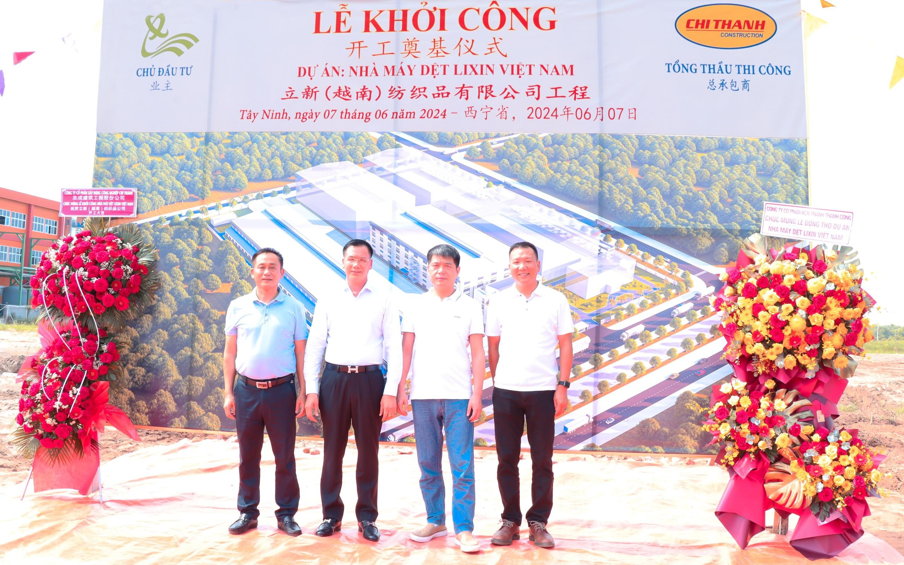

# LỄ KHỞI CÔNG DỰ ÁN NHÀ MÁY DỆT LIXIN VIỆT NAM

**Sáng nay, ngày 07/06/2024, Dự án nhà máy dệt Lixin Việt Nam do Công ty TNHH Lixin Textiles (Việt Nam) làm chủ đầu tư đã chính thức khởi công xây dựng tại Lô B7.2, Đường C3, KCN Thành Thành Công, Khu phố An Hội, Phường An Hòa, Thị xã Trảng Bàng, Tỉnh Tây Ninh. Đáng chú ý, đây là lần thứ hai mà chủ đầu tư Lixin tin tưởng chọn công ty cổ phần xây dựng công nghiệp Chí Thành (công ty Chí Thành) làm tổng thầu thi công. Sự tin tưởng này thể hiện qua việc Chí Thành đã được giao trọng trách một lần nữa, khẳng định uy tín và năng lực vượt trội của công ty trong lĩnh vực xây dựng các dự án nhà máy công nghiệp.**

<figure class="image">
  
</figure>

<figure class="image">
  
  <figcaption  align="center">Lãnh đạo và chủ đầu tư dự lễ khởi công
</figcaption>
</figure>

Công ty TNHH Lixin Textiles (Việt Nam) được thành lập vào năm 2019, chuyên nghiên cứu, sản xuất và phân phối dụng cụ vệ sinh gia dụng hiện đại. Lixin Textiles tập trung vào các lĩnh vực dệt, nhuộm, may, ép phun và ngũ kim. Với đội ngũ nhân viên chuyên nghiệp và hệ thống sản xuất tiên tiến, công ty không ngừng phát triển để đáp ứng nhu cầu ngày càng cao của khách hàng, cung cấp các sản phẩm chất lượng cao và dịch vụ tốt nhất.

<figure class="image">
  
  <figcaption  align="center">Phối cảnh 3D của dự án</figcaption>
</figure>

Tại buổi lễ, Đại diện phía chủ đầu tư đã có đôi lời phát biểu với mong muốn gửi lời chúc dự án hoàn thành đúng tiến độ, đạt chất lượng và đảm bảo an toàn.

<figure class="image">
  
  <figcaption  align="center">Đại diện công ty Lixin
</figcaption>
</figure>

## Chí Thành - Tổng Thầu Uy Tín và Chất Lượng

Về phía công ty Chí Thành, ông Lê Xuân Nghĩa - Chủ tịch HĐQT đã có bài phát biểu mang tính cam kết trước dự án đầy tâm huyết của hai bên: "Chúng tôi xin hứa với KCN và chủ đầu tư, chúng tôi thi công thứ nhất sẽ đảm bảo về an toàn, thứ hai đảm bảo về chất lượng, thứ ba đảm bảo về tiến độ công trình. Tôi cũng xin gửi lời cảm ơn tới ban lãnh đạo KCN, các nhà thầu phụ, các đơn vị liên quan đã đến tham dự buổi lễ khởi công ngày hôm nay."

<figure class="image">
  
  <figcaption  align="center">Ông Lê Xuân Nghĩa phát biểu tại buổi lễ
</figcaption>
</figure>

Tiếp theo, công ty Lixin và công ty Chí Thành đã thực hiện nghi lễ động thổ công trình:

<figure class="image">
  
</figcaption>
</figure>

<figure class="image">
  
</figcaption>
</figure>

<figure class="image">
  
</figcaption>
</figure>

<figure class="image">
  
</figcaption>
</figure>

Với năng lực và kinh nghiệm thi công hàng loạt các dự án tại khu vực Tây Ninh như công ty Ningbo Changya Plastic, Hoa Nghiêm Vina, Top Trust Biotechnology, Nature’s Mark Việt Nam, nội thất Athena, ... Chí Thành tin rằng năng lực cốt lõi, kinh nghiệm của chúng tôi sẽ mang đến chất lượng dịch vụ tốt nhất, tiệm cận các tiêu chuẩn quốc tế để đáp ứng yêu cầu An toàn, Chất lượng, Tiến độ và sự hài lòng của khách hàng.

<figure class="image">
  
</figcaption>
</figure>

## Dưới đây là một số hình ảnh của buổi lễ:

### Toàn cảnh nhìn từ trên cao:

<figure class="image">
  
</figcaption>
</figure>

<figure class="image">
  
</figcaption>
</figure>

### Phối cảnh 3D

<figure class="image">
  
</figcaption>
</figure>

<figure class="image">
  
</figcaption>
</figure>

<figure class="image">
  
</figcaption>
</figure>

### Chủ đầu tư và tổng thầu Chí Thành

<figure class="image">
  
</figcaption>
</figure>

<figure class="image">
  
</figcaption>
</figure>

<figure class="image">
  
</figcaption>
</figure>

<figure class="image">
  
</figcaption>
</figure>

<figure class="image">
  
</figcaption>
</figure>

<figure class="image">
  
</figcaption>
</figure>

<figure class="image">
  
</figcaption>
</figure>

### Hình ảnh lễ động thổ

<figure class="image">
  
</figcaption>
</figure>

<figure class="image">
  
</figcaption>
</figure>

<figure class="image">
  
</figcaption>
</figure>

<figure class="image">
  
</figcaption>
</figure>

<figure class="image">
  
</figcaption>
</figure>

### Nhân viên

<figure class="image">
  
</figcaption>
</figure>

<figure class="image">
  
</figcaption>
</figure>

<figure class="image">
  
</figcaption>
</figure>
